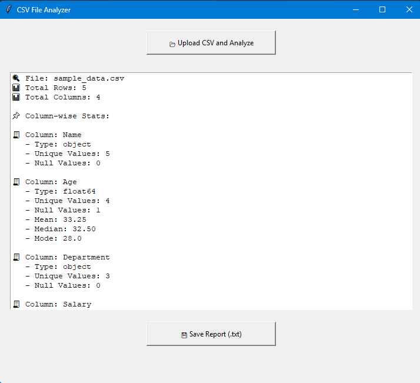

# 📊 CSV File Analyzer – A Simple & Smart Python GUI Project

Ever needed to quickly understand what's inside a CSV file without writing tons of code or opening Excel?
This project lets you do that in seconds — just upload a CSV, and it gives you a detailed, readable analysis — with an option to export it as a .txt report full of insights and emojis! 😄

---

## 🙋‍♂️ Why This Project?

This project helped me:

- Strengthen my Python & file handling skills  
- Work with real-world data using Pandas  
- Build a GUI using Tkinter  
- Learn how to deliver insights in a clean and readable format 
- Create a user-friendly, beginner-oriented tool

---

## 👋 What This Project Is About

I built this tool to simplify CSV analysis for non-technical users and beginner analysts.  
It uses Python, a touch of data science, and a simple graphical interface to make it:

✅ Easy to use  
✅ Informative  
✅ Export-ready

It was a fun project to blend **data handling** and **user interaction** — and it’s beginner-friendly too!

---

## 🖼️ Screenshot

<p align="center">
  
</p>

<p align="center"><em>📷 Simple GUI interface showing CSV insights and export button</em></p>

---

## 🔍 What It Can Do

- 📂 **Upload any CSV** file from your system  
- 🧠 **Instantly see insights**:
  - Column types (numeric, object, etc.)
  - Number of unique values
  - Null (missing) values
  - Mean, Median, and Mode for numeric columns  
- 💾 **Export analysis report** as:
  - `.txt` (plain readable)
  - `.pdf` (clean and formatted)

All done through a simple window — no coding or terminal required.

---

## 🧰 Tech Used

| Tool      | What It Does                |
|-----------|-----------------------------|
| Python    | Core programming            |
| Pandas    | Data analysis + stats       |
| Tkinter   | Building the GUI            |
| FPDF      | Exporting to PDF format     |

No fancy frameworks. Just raw Python power 💪

---

## 💻 How to Run It

1. Clone the Repository
 ```bash
git clone https://github.com/chiragdhawan07/csv_data_analyzer.git
```
2. Navigate Into the Project Folder
```bash
cd csv_data_analyzer
```
3. Install the required libraries:
```bash
pip install pandas fpdf
```
4. Run the Application
```bash
python csv_data_analyzer.py
```

---

## 🛠️ Troubleshooting

If you run into issues, here are a few things to check:

### 🔹 Python Version
Make sure you're using **Python 3.6 or higher**.

Check version:
```bash
python --version
```

---

## 🧩 Missing `tkinter`? Here's How to Fix It

`tkinter` is the standard GUI library for Python. It's usually bundled with Python, but if you're getting errors like:

> ModuleNotFoundError: No module named 'tkinter'

Then you may need to install it manually, depending on your operating system.

---

### 🖥️ Windows

`tkinter` typically comes pre-installed with Python on Windows.  
If it's missing, try re-installing Python from the official website:

🔗 https://www.python.org/downloads/

Make sure to check the box **"Add Python to PATH"** during installation.

---

### 🐧 Linux (Ubuntu/Debian)

Install it using `apt`:
```bash
sudo apt-get update
sudo apt-get install python3-tk
```

---

### 🍏 macOS (with Homebrew)

Use Homebrew to install:
```bash
brew install python-tk
```
> If you're using Python from python.org, tkinter should already be bundled.

---
## 👨‍💻 Author

Built with ❤️ by [Chirag Dhawan](https://github.com/chiragdhawan07)


